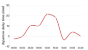
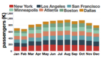
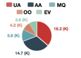
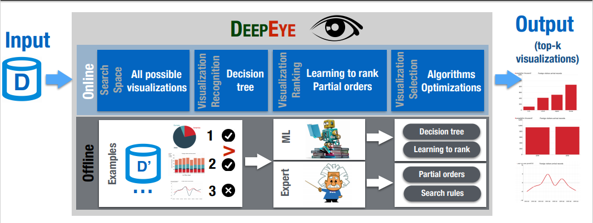

# deepeye_pack

##### *An automatic data visualization Python package*

## Introduction
1. This is a Python package to wrapped up the DeepEye API using Python 2.7
2. The DeepEye system is an automatic data visualization system which can easily visualize data without too much effort. It is designed to provide with really simple usage.
3. The DeepEye system Github page: [https://github.com/TsinghuaDatabaseGroup/DeepEye/tree/master/APIs_Deepeye](https://github.com/TsinghuaDatabaseGroup/DeepEye/tree/master/APIs_Deepeye)
4. The original paper: [DeepEye: An automatic big data visualization framework](https://ieeexplore.ieee.org/document/8268737)

## Problem Research
1. Q1: Understand the foundation of DeepEye system
2. Q2: Analyze the design of DeepEye APIs
3. Q3: Design a set of process to wrap up the APIs

## Analyze Process

1. The traditional process of data visualization can be visualized as following

```
- Load Dataset
- Select Attributes   ←←←←←←
- Data Transformation      ↑ LOOP
- Check Visualization →→→→→→
```

2. This process is too complex because one set of data can be visualized into many different patterns.
> e.g. 
> 
> | Line Chart   |    Bar Chart  |  Pie Chart |
> |---|---|---|
> ||  |  |

3. And the combinatin of all attributes can cause it too laborious and time-consuming to find the perfect choice for the resulting visualization. 
4. Hence, the DeepEye system is to solve the above problems  

5. The DeepEye system can be described as the following parts:

```
1. Visualization Recognition - Whether the chart is good or bad
2. Visualization Ranking - Which are better charts
3. Visualization Selection - Select the top-k most suitable charts  
```
6. The architecture of DeepEye system can be illustrated as following:




## Implementation Process
### Overview
1. Understand DeepEye System workflow
2. Design wrapper workflow based on the above
3. Implement initialization process of wrapper
4. Implement multiple data import methods
5. Integrate the DeepEye algorithms into wrapper 
6. Implement multiple output methods 
7. Testing the process on multiple platforms

### Understand DeepEye System workflow
1. As described in the [Analyze Process](#analyze-process)

### Design wrapper workflow based on the above
1. Deepeye-pack should be user-friendly and easy to use
2. Based on the 'Query' idea of DB - User can 'query' charts by a set of commands
3. The process is concluded as:
```
1. Set up the attributes and types of a table
2. Import the data from file or DB
3. Choose different methods to generate the visualizations(Learning to rank, Partial order, Diversified ranking)
4. Output the result in multiple way(html, jsons...)
```

### Implement initialization process of wrapper
1. Set up the table info for DeepEye
2. User should specify the attributes needed and the types of them accordingly
3. Define a class to handle all the methods

### Implement multiple data import methods
1. Since the data can be imported from different sources, I need to make sure the data imported from different methods are the same
2. The requirements from the lab is to imported from MySQL and csv file. 
3. For the MySQL method, import relative packages and wrap the package into one command to query all data. Pick attributes needed according to initialization
4. For the csv file method, simply import and filter attributes not required.

### Integrate the DeepEye algorithms into wrapper 
1. Import DeepEye to make sure the algorithms work for the current package.
2. Prune the non-required code and make sure it won't hurt the dependency

### Implement multiple output methods 
1. When generate multiple charts, the management of the result data is messy
2. Clean and file the output data in multiple fashion. Hence, the user can choose on their need

### Testing the process on multiple platforms
1. Wrap into package and tested under different OS

## My role in the project
1. This is a project made during my time @Datalab in Tsinghua University in Beijing
2. I was assigned this task by the leading professor of the lab [Guoliang Li](http://dbgroup.cs.tsinghua.edu.cn/ligl/)
3. During the development, I was under the instruction of an excellent doctoral student - [Yuyu Luo](https://scholar.google.com/citations?user=FAjYJkQAAAAJ&hl=en)
4. Huge thanks to Professor Li and my friend Yuyu Luo

## Conclusion
As this is my first time working alone on one project, I was not familiar with the environment and the working methods. I was encouraged to learn most of the knowledge through Internet because the algorithms used are pretty much mature for a long time.

After a basic understanding of the concept of the system, I worked around on their demo websites many times to get a proper idea of how to design my wrapper can be a more popular fashion.

Besides building the wrapper, I also looked into the implementation of the DeepEye algorithms. Though the fact that I was not capable of building the system on myself, I get in the first contact with deep learning and ranking algorithms which enrich my knowledge a lot. 
