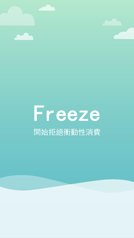
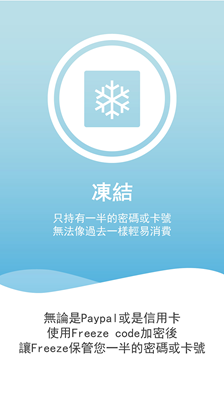
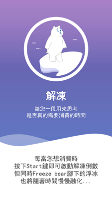
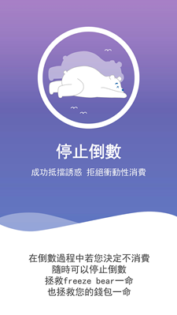
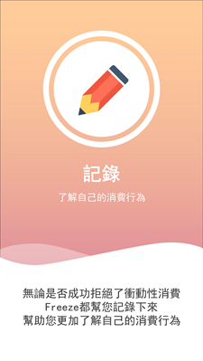

# FROZEN

##### *Freeze your impulse to buy*

## Introduction
1. FROZEN is an app to prevent impulsive consumption 
  
2. It aims to use a simulation game to prevent user from buying stuff they dont actually need   
  
3. When you first enter the app, you need to change your password or your payment method
    - If you choose to use **OTP(One-Time Pin)** as payment password, we would implement a mechanism to **"Freeze"** your access to the OTP.
    - If you choose change password, we would told you a secret key which you need to add to your own password. Together they form the whole password, and we would **"Freeze"** it before you buy anything.  
  
4. We would ask you a few questions about what you are about to buy according to the necessity and emergence of the product.
5. And we would also ask you to stop for a while according to your previous consumption method
6. If you successfully gave up the idea of buying, then you will be rewarded in the game
7. However, if you insisted to buy, you would be punished in the game 
  
8. Apart from that, we would record every time of your consumption intention and evaluate of your user sketch 
  
9. Your game performance is based on the action of your every consumption

## The Game 
1. The game's theme is regarding polar bears on ice bergs
2. Your actions represent virtual carbon footprint 
3. By buying more stuff, more virtual carbon footprint is created. Hence, the ice berg would shrink, threatening your polar bears
4. By buying less, less virtual carbon footprint is created, the ice berg will grow and attract more polar bears on to the ice berg
5. When your ice reach certain value, an amount of donation would be sent to the foundation `polarbearsinternational.org`   

## Presentation
<iframe src="https://prezi.com/embed/-xk-5yjc41aw/" id="iframe_container" frameborder="0" webkitallowfullscreen="" mozallowfullscreen="" allowfullscreen="" allow="autoplay; fullscreen" height="315" width="560"></iframe>

## My Role in the Team
## First task
1. My main responsibility is to coordinate the communication between front-end and back-end
2. Both teams were working on their own side and forgot the other one completely
3. When we tried to combine, there were too many issues to handle
4. I had to design a DB for the communication to go through 

## Second Task
1. Another of my responsibility was to develop the prompt system for the game.
2. The system is highly related to the user behavior
3. If the prompt was too frequent it will cause the user to become annoyed and causing the customer stickiness of the app to drop
4. We discuss several times to decide when is the best time for the prompt to come out and as in what kind of styles
