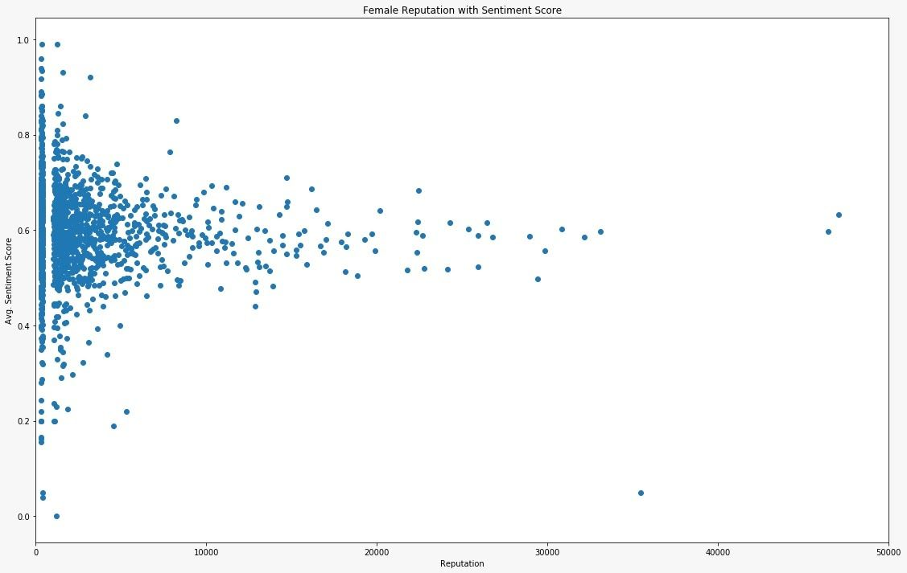

# Gender Differences on StackOverflow

##### *So... What's the population sketch of the world's largest SEs' community?*

## Abstract
- With the rise of programming as an essential job in every market, people have been eager to learn and evolve, and thus some platforms were developed to share the knowledge between programmers. 
- Stack Overflow was our choice for the study of gender differences on this kind of platform, due to the criticism it received for being toxic, sexist and sometimes racist. 
- The purpose of the study is to understand the gender differences on Stack Overflow in terms of participation, and in order to figure that out we used several APIs for data collection and analysis, for example Microsoft Azure sentiment analysis tool to analyze the results of each gender. 
- We later found out that: 
    1. Men and women ask approximately the same number of questions while men roughly answer twice as much. 
    2. Women have a more spread sentiment polarity than men, even though the average score for both was almost neutral. 
- We then conclude that even though our results might not have shown lots of differences between men and women, they paved the way for future studies to ask why instead of what and look for the reasons behind these results we got.

## Introduction
Through our research, we have strived to bring to light the gender differences in participation of users on the professional question and answer site, Stack Overflow. The platform is focused around a wide range of computer programming topics and has received criticism in the past for its toxic culture and unwelcoming environment. Stack Overflow has become so heavily utilised because its incentives such as reputation points and badge awards make it an efficient way to exchange and share knowledge. The community on the site places a high level of importance on these arbitrary achievements because many people use their Stack Overflow account to add to their resume to show that they are knowledgeable in their field. Many people use this platform very seriously and we believe that the real life value of Stack Overflow makes it an effective medium to analyse the divide between the participation of Men and Women in the programming community.

### Our goals
The key objective of our research is to investigate if and how men and women participate differently on Stack Overflow in order to better understand the gender differences in the programming community. Research into the causes of differences is necessary, which is why we would like to better understand the dynamics of participation in order to improve the value of crowdsourced knowledge. Our research has focused heavily on answers because the quality of responses is crucial for the success of Stack Overflows incentivizing systems. We want to understand if there are differences in answers between users of differering reputation scores and to recognize if there are differences between men and women in how they formulate their answers to questions. Our results will be used as a starting point for further investigation of the underlying reasons that account for these conclusions.

### Research Questions
In our research, we focused specifically on the following research questions:
    1. Does the number of questions and answers posted differ between men and women?
    2. Do men and women express their answers differently? How does the sentiment differ in their answers?
    3. How does the sentiment of the answers with regard to the user’s reputation scores and rewards differ between men and women?
Keeping our research questions in mind, we had hypothesised that Men would have a higher number of answers and that the sentimental analysis would prove that there are stark differences in the way that Men and Women express their answers.

## Implementation Process
### Overview
- Data collection is a process which plays a vital role of the project. 
- In order to collect the data for further investigation, we need a lot of APIs and tools to help us gather or analyze the data we need. 
- For this project, we decided to use Python 3 as the main programming language because of the interactive and data-prone attribute of itself. However, we took the Jupyter notebook as ‘playground’ to construct the framework. 
- After the test run, we converted the code into a script with classes and ran them in the command line. 
- As of the size of the data, we took it step by step listed below. 
    1. Each team member first gather the requir data for each step and combine them together for the next step. 
    2. Collect the user data with [Stackoverflow API](https://api.stackexchange.com/) (in short SO API ) with attributes we need.   
    3. Convert location infos through [Bing](https://www.bingmapsportal.com/)/[Google Maps](https://cloud.google.com/maps-platform/) APIs and infer the gender of the users with a Python package called [Gender Guesser](https://pypi.org/project/gender-guesser/)
    4. Clean and filter the data according to the gender. 
    5. Crawl answers of each user and analyzed the sentiment of the answers with [Microsoft Azure sentiment analysis service](https://azure.microsoft.com/en-us/services/cognitive-services/text-analytics/).

### Data Retrieval by StackOverflow API(SO API)
- Stackoverflow provides a series of different APIs which enable us to access the data conveniently. 
- However, the rules of how to access the data is quite strict. Without an application key, each IP can only have up to 300 queries/day.The amount is too few which doesn’t match our requirement. 
- Luckily, they provide an ‘application method’ which enables each application with 10,000 queries/day. 
- Each user needs to apply for the application on Stackoverflow and the API would be usable only through OAuth 2.0. 
- Besides, the API has a time restriction that would require some backoff for crawling. 
- After the problems with the restriction were dealt with, we discussed which attributes we need for the users. 
- The attributes include information, the number of questions and answers and additional ones listed in the below:<br>
```
    - user_id
    - display_name
    - gender
    - location
    - badge_counts
    - reputation
    - accept_rate
    - question_count
    - answer_count
    - up_vote_count
    - down_vote_count
    - account_id
    - user_type
```
- With the information, we then transfer the code to script and batch the crawler with some technique that allows us to crawl up to 1,000,000 users/day with each application. 
- Nonetheless, we decided to use only a small portion of the allowance because some of the queries should be used on the following parts.

### Gender Guesser with Bing/Google Maps API
- Next, we tried to infer gender from the data we have. 
- First of all, we discussed the tool we need for the inferring and chose the gender_guesser python tool. 
- Gender inferring requires both the real first name of the user and the country of the user. 
- Nevertheless, the name and location of raw user data didn’t meet the input requirements. 
- Therefore, we decided to retrieve the first name and convert the location to country with Bing/Google Maps APIs to fit with the input. 
- The result came out quite nice and we would look into them in the Analysis part.

### Data Preprocessing
- Now with the user data with gender, we need to decide our sample base. 
- We first combine the data from each team member and remove the duplicated and non-user data by checking whether the user is registered or not. 
- Then, the uncertain gender(mostly male/female, unknown) were removed from the data. And to verify our result by gender guesser, we sample 50 male and females from the results to verify them manually on the Stack Overflow site. 
- Furthermore, we kept the balance between male and female dataset by shuffling and sampling the male data to the number of female data.

### Sentimental Analysis
- With each user and their gender, we now be able to look at the last two parts of our research questions regarding the sentiments of the answers of each user. 
- The process is done by using the Microsoft Azure Text Analytics tool. The tool is very powerful and easy to use. We can just pass the text and it would return a score between 0 and 1. The sentiment is more positive if the score is higher. 
- For each user, we crawl max 50 answers for analysis. But when we checked the answers from the SO API, we found out the answers themselves contain quite a lot of other information regarding code blocks and markups. These sections are cleaned up first before we send them to the Azure API. 
- With each user having their score with different length, we stored the data to json to better accessibility.

## Results
- In this section we discuss our findings and provide insights into the participation of genders
based on the research questions.

### Research Question 1: 
> **How does the number of questions and answers posted differ between men and women?**


The first question we ask is whether we can see a difference in the activity levels of men and women on the site. Our key variable is the number of questions asked and the number of answers posted, and we see that there are significant differences between men and women.

The Fig.1 shows the average activity levels across genders. In our methodology, we used mean values to calculate the average number of questions and answers. It is an important element of our data that we need to analyze since it represents the engagement on the site per gender. The average number of questions asked is 23 for men and 27 for women, while the average number of answers posted is 150 for men and 78 for women. In other words, men answer 48% more questions on average than women do, while women ask 15% more. There are several possible explanations for this finding, however, it is not exactly clear why this is the case. For instance that the patterns of behavior on the site have changed, or because of our approach to gender inference (i.e. we used gender-guesser) or data selection (i.e. we collected the data sorted by the most reputable genders). Therefore, men are more active on the site across these metrics. Furthermore, we also found that women are more likely to ask questions and are less engaged in the Q&A discussions.
 
### Research Question 2: 
> **Do men and women express their answers differently? How does the sentiment differ in their answers?**

As mentioned in the previous section we found differences in both activity and outcome between men and women. In this research question, we ask whether there are any differences in how men and women express their answers? Specifically, how does their sentiment differ? We plot polarity score distribution box plots for both genders in below 2 Figs.


We found that women tend to have more spread sentiment polarity distribution, as opposed to men, who tend to answer the questions in a more neutral way. It is not clear what might be the reason, as future research must be done to explore the potential reasons. In below fig, we can also observe that most of the users who are men tend to score closer to the neutral polarity. It is also the case that women score higher than men in both the positive and negative ends of the spectrum.


### Research Question 3: 
> **How does the sentiment of the answers with regard to the user’s reputation scores and rewards differ between men and women?**

In this research question, we ask how the sentiment of the answers influences the probability of having higher reputation between the genders? The primary way to gain reputation is by posting good questions and useful answers. A user gains reputation when the answer is voted up, the answer is marked “accepted” and others.   

We plot the average sentiment scores per genders as well as their reputation in below 2 Figs. The users who tend to give answers in a more neutral form tend to have a higher reputation than the user who answers sound closer negative or closer to positive. In terms of gender differences, the distribution of the women’s reputation is skewed up towards a more positive sentiment. Nevertheless, the correlation between high reputation and neutral answers is still visible in both genders equally.   




We also considered how the sentiment of an answer is correlated with the users’ rewards. On StackOverflow, users get badges by participating on the site. There are a variety of different badges, but they’re all categorized into gold, silver, and bronze ones. In our study, we assigned them the weight from 1 to 3 depending on the value of the badge. We have then explored the relationship between the user’s average sentiment scores. The distribution of rewards for both genders are very similar regardless of their average user sentiment scores (in below 2 figs.)


## References
1. [Predicting the Quality of Questions on Stackoverflow](https://www.aclweb.org/anthology/R15-1005.pdf)
2. [Someone like me: How does peer parity influence participation of women on stack overflow?](https://www.semanticscholar.org/paper/Someone-like-me%3A-How-does-peer-parity-influence-of-Ford-Harkins/bb37f9aa5a1aaf918688612743f2efbf56f608a4)
3. [Discovering value from community activity on focused question answering sites: a case study of stack overflow](https://dl.acm.org/doi/10.1145/2339530.2339665)
4. [Confidence in Programming Skills: Gender Insights From StackOverflow Developers Survey](https://ieeexplore.ieee.org/abstract/document/8802654?casa_token=zTDjpcH0K5cAAAAA:jSG0mcWTz1fjHQOdQgw6IMHOzjI9myqpY_F9vLlcCumc1RcZGkN7qMztkWWGUR6MyGBDdxIl-g)
5. [Google Scholar Search](https://scholar.google.com/scholar?hl=de&as_sdt=0%2C5&q=sentiment+analysis+stackoverflow&oq=sentiment+analysis+stack#d=gs_qabs&u=%23p%3Df4m9h-3YeJcJ)

## My role in the project
- I implemented most of the Python script in the entire project
- Especially handled the large data crawler and work out solution towards the Azure services
- I also resolved the API limit of Google maps and Bing maps and mapping of countries 

## Conclusion
- In our research, we have provided some insights into the behaviour of men and women on the developer platform StackOverflow that women ask more questions than men, whereas men post more answers. 
- We further achieved more insights into the way users express themselves in their answers.
- Huge thanks to the Lecturer of this course at UZH - [Prof. Dr. Anikó Hannák](http://ancsahannak.me/) 
- Also great thanks to my partners in the Social Computing Lesson. Especially, Natalie Hennig and Daniel Gareev. 
- A Great exchange experience which enhance my ability to conduct researches