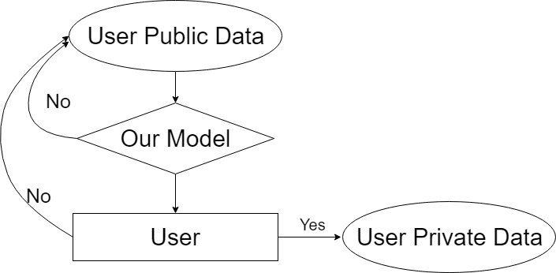

# Modeling user willingness of data contribution in online social networks

##### *Help to collect your data from social network faster*

## Introduction
1. A Python Machine Learning Model that helps to collect data from social network in a more efficient fashion
2. This is my Bachelor Thesis 

## Problem Research
Under the implementation of GDPR(General Data Protection Regulation) since 2018, Social network companies like Facebook and Twitter would apply more protection to their data. However, in order to research on topics regarding social networks, data collection would become harder. Hence, we would like to acquire the public data on social network and analyze them through machine learning model based on the individual elements and situational elements. Eventually, we would like to find users who are more likely to provide their private data through our model. 

## Analyze Process
### Questions
1. What is the relationship between the user willingness and their public data?
2. Generally there are ground truth for questions to be solved by ML models, however, is there such a ground truth in our question?
3. The young people are more likely to receive our survey instead of the elder ones. Will this cause any bias problem?
4. Lots of values on the public data would be missing, is it possible to solve the problem through preprocessing?
5. How to select the model and refine it to increase accuracy and eventually reach the goal?

### Flowchart
Flowchart of our model

## Current Research Comparioson
> Social network now plays an important role in everyone's life, therefore the protection of eyeryone's data becomes an important question. The following paragraph will focus solely on the relationship between user willingness and their behavior and data
### User Consent Analysis
1. The elements which affect social group willingness are as following:
    - Privacy Paradox 
        - Users care about their privacy when asked about, but they don't protect their privacy enough on the Internet 
    - Perceived Privacy
        - Users' perception of privacy danger differ from the actual danger
    - Context
        - Users' more likely to trade their private data for services or benefits
    - Culture
        - Different culture treats privacy differently
    - User Diversity
        - Users' education background, personality and etc. affect how they react to privacy protection
    - Gender
        - Different gender treats privacy with different attitude
2. We would conduct our research according to the above aspects in a data science perspective

## Implementation Process
### Data collection
1. Collect the users' willingness  through survey over Faceboook regarding:
    - Whether they are willing to give their public account information to academic experiemnts without payment
    - Whether they are willing to give their public account information to academic experiemnts with payment
    -  Whether they are willing to give their private account information to academic experiemnts without payment
    - Whether they are willing to give their private account information to academic experiemnts with payment
2. The survevry is distributed on multi different platform and channel to achieve as little bias as possible.
3. Crawl the data according to users' willingness. Mostly their public account information such as  
    - personal data
    - friend list
    - liked posts
    - number of posts
4. We used *selenium* and *Beautiful Soup* and several bot afcebook accounts to crawl the above mentioned data
5. The active data like posts and likes are crawled in a limited time frame 

### Data Preprocessing
1. The dimension of the raw data is quite high - for over 37 different attributes including educational background, working experience, birthday and etc.
2. The raw data also has a quite high percentage of missing values. If one attribute has too high missing value, it will be removed. If low missing value, interpolation is used to fill up the missing value
3. For Example, User ID is removed because it does not provide any meaning
4. The raw data is then categorized using nominal feature, ordinal feature and temporal feature.
5. If features are being too similar, we would combine the features together
6. For nominal features, one-hot encoding is applied to remove bias. For some of the ordinal features, total and frequency over time can be calculated. As for the temporal features, most of these are binned up by a week or a month 
7. We categorized users' hometown and living place according to continentals using GeoMapping and Google Maps API. 
8. We sorted the educational backgrounds according to the QS and similar ranking standards
9. The raw data is then divided into train data and test data using K-fold cross validation
10. The raw data is scaled standardized and normalized as well
11. The feature selection and extraction were then applied to the raw data. Such as Sequential Backward Selection to remove noises and LDA can select important features.

### Training
1. We selected several models such as SVM, random forest, adaboost and xgboost which fits better with smaller dataset
2. We applied SMOTE to do upsampling to balance the ratio of the positive and negative data 
3. We then use grid search to refine the parameter for the model

### Performance Conclusion
1. The basic accuracy is around 72%

2. After refining, the accuracy is now at 82%

3. The accuracy can be further improved if more user data can be collected.
4. Also, as described above, the users' willingness is highly related to one's personality as well, so maybe inspect the content of the posts to identify the personality would be a good break.

### Active Learning
1. As our research move on to the next level, we found out that we lack of data
2. Our research is 'small-dataset', 'low cost to achieve non-labelled data' and 'high cost to label each data'.
3. Therefore, it is a perfect fit for Active Learning
4. Our plan is to crawl large data on Facebook and ask the user about his or her willingness about giving the data, which can further used on training the model itself.

Model of the Active Learning

5. The action to pick up which users to ask is called **query strategy**
6. The labeled data would then be feed to an AL **Learner**
7. There are various query strategies the unlabelled data. Besides the default methods, we implemented our own  query strategy
8. These query strategies were combined and cross-validated through the grid-search
9. The iteration can quickly convergent after 200 queries
10. And the result of the different query strategies are as followed:
    - 
    - 
    - 
    - 
    - 

## Reference
1. Laufer, R. S. and Wolfe, M., Privacy as a concept and a social issue: Amultidimensional developmental theory, 1977.
2. Martina Ziefle, Julian Halbey and Sylvia Kowalewski, Users’ Willingness to ShareData on the Internet: Perceived Benefits and Caveats, 2016.
3. Jie Zhao, Chanjuan Zhu, Zhixiang Peng, Xin Xu and Yan Liu, User Willingnesstoward Knowledge Sharing in Social Networks, 2018.
4. Catherine, M., Some antecedents and effects of trust in virtual communities, 2002.
5. Burr Settles, Active Learning Literature Survey, 2010.

## My role in the project
1. I am mainly responsible for the data preprocessing and model refining
2. I refined the model to increase its accuracy for 20%
3. Furthermore, I handled most of the implementation of the Active Learning's query strategies

## Conclusion
1. This Project brought me great impact over ML
2. Its the very first big scale ML project
3. I not only learned the programming of ML but also the proper way of conducting research on ML-related issues
4. The project also increased my interests on the social computing
5. I started to be aware of the things that we missed when using the convenient services provided by the online/game companies these days
6. When they tricked us in exchange with our priceless data, they didn't protect them and ever worse. Some of them even sell them for benefits.
7. I am proud that I have conducted this research under my instruction professor - Professor Chih-Ya Shen
8. And huge thanks to my colleagues 羅士鈞 and 黃竣詳 