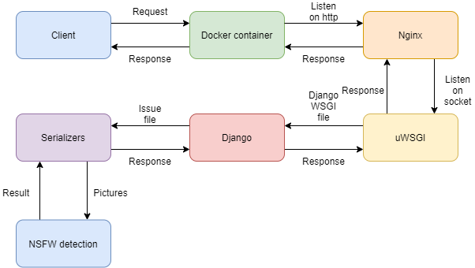

# NSFW Detection 
##### *Not Safe For Work content detection API*

## Introduction
1. The NSFW Detection is a RESTful API which can identify adult content through a CNN-model
2. The NSFW Detection is built with Django
3. The NSFW Detection is containerized into Dockerfile and docker-compose, so you can deploy them in any docker-installed instance

## Requirements of the project
1. Batalk is an online board game platform 

<iframe width="900" height="506" src="https://www.youtube.com/embed/dDE2Wk9QPCs" frameborder="0" allow="accelerometer; autoplay; clipboard-write; encrypted-media; gyroscope; picture-in-picture" allowfullscreen></iframe>

2. It grew to a larger user population and the user regulation became stricter when the chat function is developed 
3. App Store requires Batalk to developed a mechanism to filter the NSFW(Not Safe For Work) content
4. Therefore, the task is to developed an API which can detect whether the uploaded images to the server is NSFW or SFW(Safe For Work)

## Possible solutions
1. While there are several popular backend frameworks which are suitable for the project, I still recommended Django as the Backend Framework
2. Not only because I am familiar with this framework but also because it provides a very intuitive way to establish an admin backstage for the maintainer to inspect the status  

## Concept of Implementation
1. The NSFW Detection uses the [Tensorflow Implementation of Yahoo's Open NSFW Model](https://github.com/mdietrichstein/tensorflow-open_nsfw) to act as the detector
2. When NSFW Detection receives an API request, it would first be distributed through Nginx
3. Then the uwsgi would receive the data from Nginx so Django may be able to process the info
4. The Django engine would identify the input type, e.g. url, image or base64 and issue them to relative corresponding serializers
5. Serializers would then preprocessing each image and use the detection model to detect the image
6. Then the result which contains file_name, user_id, test_score and etc. would be returned 
7. The NSFW Detection also has an admin backstage which can be access through browser and monitor the status of the detection status
8. The NSFW Detection can deal high-concurrency problems using Nginx
9. The average response time is 3~4 seconds

## My role in the project
1. This is the project during my intership in [Batalk LTD.](https://play.google.com/store/apps/details?id=fun.batalk.app&hl=en) 
2. I am responsible for all of the implementation of the tasks
3. The features and functions are requirements from my manager Leo Zhang

## Github Links
1. https://github.com/tpchris1/nsfw_detection
