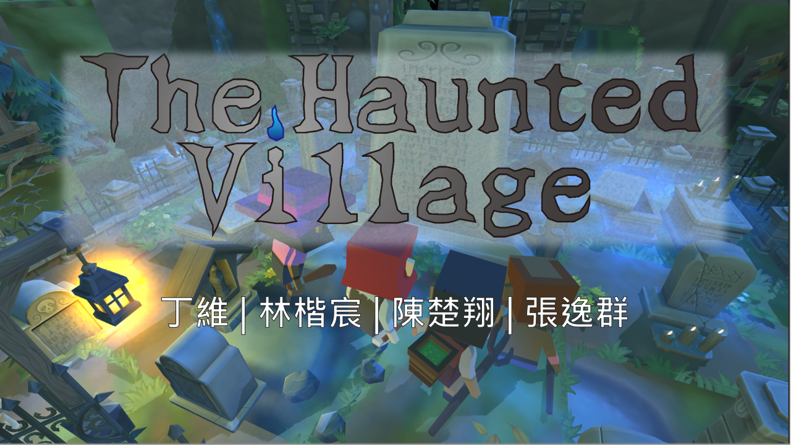
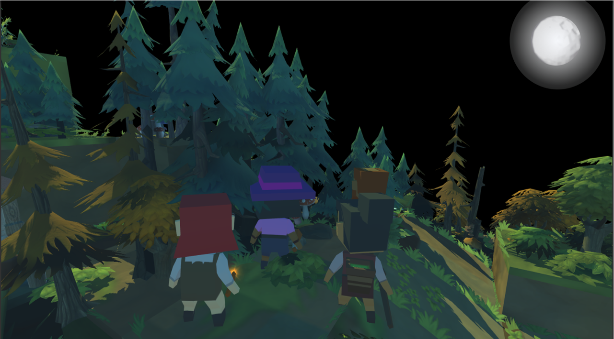
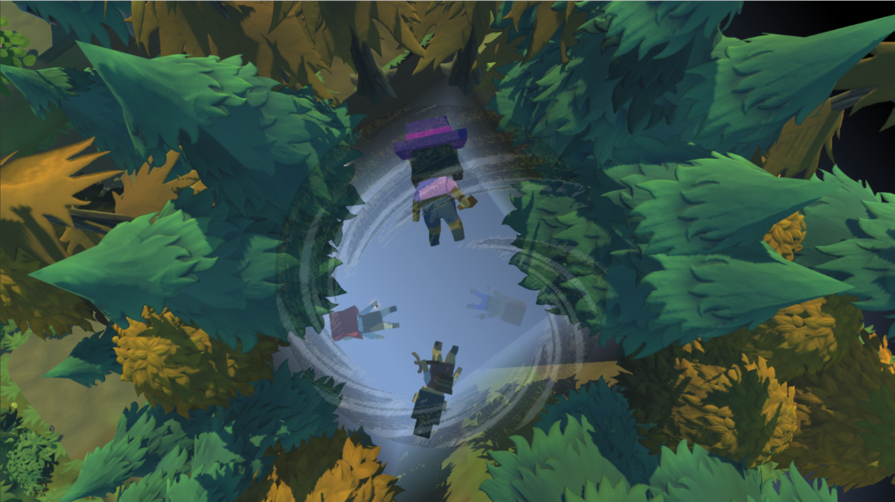
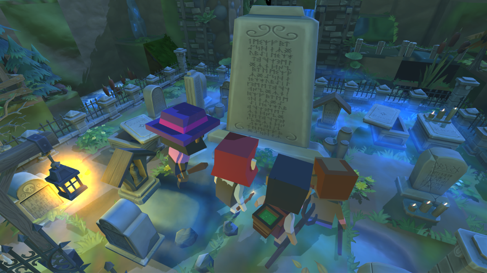
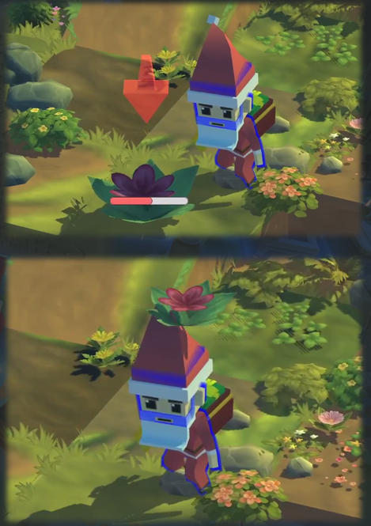
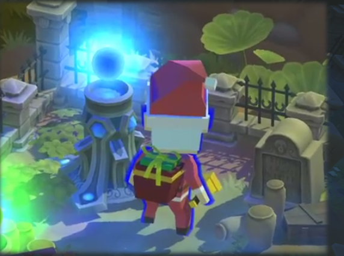

# The Haunted Village

##### *Escape from the ghosts with you best friends PC!*

## Introduction
1. This game is my first game made with Unity 2019
2. It is a party game with spooky style. The Haunted Village focuses on the competition between friends.
3. It can be controlled through 4 Xbox controllers or mixed use with keyboards. 

## Game Story
Four young people went to travel in the deep woods. "I hope we will be fine, this place looks so creepy." One of the four youngs said When the night falls. 

Just as the sentence ended, they all fell into the ground...

When they wake up, they found there is a big monolith saying: "Only the bravest hero who collect the most sacred flowers can survive in the coming mayhem!" The zombies and monsters came all together and attacked them...  

## Gameplay Method
1. Each player need to survive the attack from the monsters. 
2. Besides that, player needs to collect as many flowers as possible 

3. And then sacrifice them to the mountain god

4. Each player can also frame other players by pushing them towards the edge of cliffs
5. Multiple kinds of props are scattered around the map and player can use them to frame other players 

## Implementation Process
1. When decided to make this game, my friends and I were a big fan of Nintendo games. Since they are the "icon" of party games in the current time, we would like to make party games that we would also want to play.
2. After looked into different kinds of party games, we found out that the key to party games are creating "sparks" between the players. 
3. Usually, co-op can make the players more united but also can cause the game experience relatively due to the ability gap between players. However, if the game mechanism itself is already easy, then competition between players usually can create more sparks then co-op.
4. Therefore, we decided to make the game operation pretty easy. Simply move around and push other enemy down.
5. Nonetheless, by just competition between players is too lame. It would be boring really soon, because the game won't ends until the time finished. As a result, we decided to add another task, which is to gather the flowers, to stimulate sparks between players. Now they not only need to frame each other, but also need to fight for the resources.
6. The whole game is divided into GUI, Asset, Algorithm and Design, four section. 
7. While we established the scene as a 3D pixel-like world, the assets for the players were also pixel art.
8. We create a GUI which can be navigated fully through the Xbox controller and provide basic instruction and background of the game
9. The animation and movement systems are implmented right after the initial asset allocation. The movement system were alter many times to be more natural for tthe players.
10. The props generation and flower generation are created with genius random algo to make sure that the generation speed would be reasonable according to the number of players
11. The balance and game experience of the game is the hardest part. After 20 people played the game, we collect data and analyze which is better for us to change the game.

## Demo Video
<iframe src="https://drive.google.com/file/d/1LSwHYHQa0LcMZjQNSIPa7SGUKD7WRrsY/preview" width="640" height="480"></iframe>

## My role in the project
1. I mainly focused on the algorithm part of the house, GUI design and implementation, the movement system and the whole game project management
2. Also allocate various assets through different channels
3. Testing and improving of the game

## Conclusion
This is the best experience I have ever had during my bachelor. I really love building my own games and enjoy the joy when people played my games.
I learned more than the skills to make games but of the most important to manage the project and the  communication skills during my collaboration with my teammates.