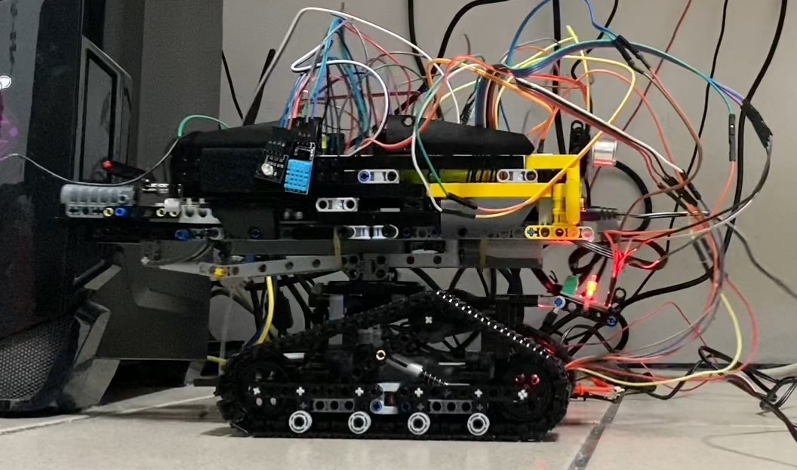
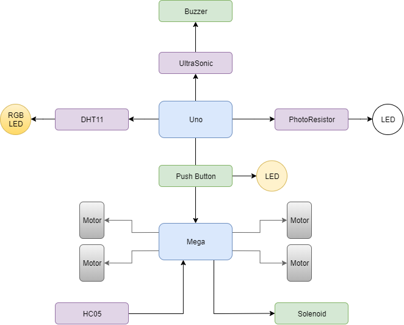

# The Tank Gen2 - Arduino Based
##### *A Lego Tank!!*
## Introduction
- This is a Arduino-based mobile Lego tank which can be controlled by an Android phone through Blynk
- The Tank Gen2 is the upgrade version of the [Gen1 - FPGA-based one](the_tank_fpga.md)
- Since the Gen1 is rather small and not strong enough
- Gen2 has made a significantly big change compared with Gen1
- Be sure to check Gen1 if you want more details for the background stories

## Feature
- It has two main structural parts
  - Upper: Turrent
    - Turrent can lift and turn left and right
    - Turrent can fire 
  - Lower: Base
    - Base can also turn left and right
- There are a total of 4 motors to drive the Turrent and the Base
- It has two front lights which can be manually controlled through push buttons
- It has an Ultrasonic sensor that can detect enemy upfront
- It has a Thermal sensor which can light up alarm RGB LED to certain temperature and humdity
- It has a Photon Resistor which can light up the front lights when environment is dark
- It has a Canon which can shoot Lego parts and is controlled by a solenoid
- Moving, Shooting and Lighting can be controlled by an Android Phone through Blynk 
  - The Tank communicates with the phone by Bluetooth through a HC05 Bluetooth Chip  

## Parts Used
1. TO BE FILLED
2. Please refer to [Architecture](#architecture) first

## Architecture

## Demo
1. Development Phase 1: Base Structure
<iframe src="https://drive.google.com/file/d/1u2WDebx-X5dAJksZ1aIMvH_3ynkV6etc/preview" width="640" height="480"></iframe>

2. Development Phase 2: Phone Working 
<iframe src="https://drive.google.com/file/d/1Gj4R7ZMf_cZWyUgW2XmgbesmuxcJnVgy/preview" width="640" height="480"></iframe>

3. Development Phase 3: Torrent Moving  
<iframe src="https://drive.google.com/file/d/11wpNsJSnh6P7JY5JcGrKQESzzL23WBw6/preview" width="640" height="480"></iframe>

4. Development Phase 4: Shooting
<iframe src="https://drive.google.com/file/d/1-zFcf84S6gXL3QOTLNZ1Q0CUwwh_mmG6/preview" width="640" height="480"></iframe>

5. Development Phase 5: Moving 
<iframe src="https://drive.google.com/file/d/1gB1mzGJt9HmFnv_Klw5IjJR7N64vAoIX/preview" width="640" height="480"></iframe>

## My role in the project
1. This is the final project of the course *Intro. to Embedded System*  
2. I am responsible for all of the implementation of the tasks including Lego mechanism, circuits and motors and programming over Arduino

## Conclusion
