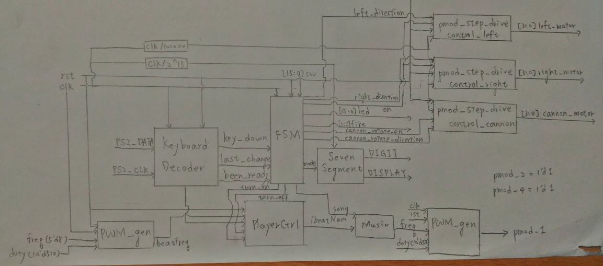
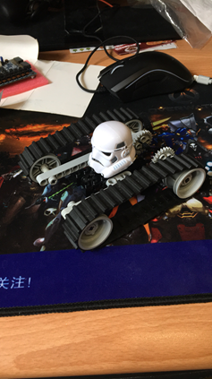
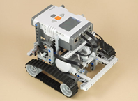
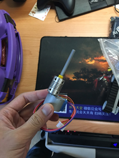
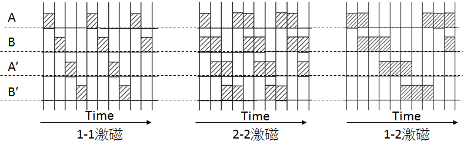

# The Tank Gen1 - FPGA Based

##### *A Lego Tank!!*

## Introduction
1. This is an FPGA-based mobile Lego tank which can be controlled through keyboard
2. The FPGA is the Digilent Basys-3 Dev Kit developed under Vivado using Verilog
3. The Tank is equipped with two 5V stepper motors powered by 4 AA 1.5V batteries
4. The Tank is also equipped with another stepper motor to power the base of the canon which can fire Lego using solenoid

## Problem Research
1. When my teammate and I decided to start this project, we had no clue of which components or parts we were going to use
2. But we were very clear about what our goals are
    - A Lego tank
    - It can move
    - It has a canon or turrent which can move
    - It can fire Lego bricks 
    - It can be ccontrolled by some sort of controller
3. Based on the above goals, we wanted to verify the feasibility of these goals
4. First of all, we wanted to verify whether our FPGA board can drive a motor with load. After several discussion, we believe that the DC motor we could bought cannot provide enough torque. Hence, we chose stepper motors to drive the Tank
5.  Therefore, we tried to power the motors through a very simple experiment with some motors, some ULN2003 drive boards and some tissue, some wire and 4 AA batteries.

<iframe src="https://drive.google.com/file/d/1OyoVMeKK6JjSND5akg_K3LWaHw_x1ve4/preview" width="640" height="480"></iframe>
6. It turned out to be pretty successful, then we can formally establish proposal of this project and go for next stage 

## Feature
1. The Tank can move forward and backward
2. The Tank can move left and right
3. The Tank can rotate the canon horizontally
4. The Tank can make sounds when firing the canon
5. The Tank can show the current status using 7-segment display
6. The Tank can simulate an engine start and off using FSM
7. The sketch design of the FSM for the Tank is as below

## Implementation Process
1. The Lego structure is the very first important thing to finish because we needed to make sure that the structure was stongr enough to load these many parts on it 
2. Therefore, the base of the Tank is as below

 
3. Our ultimate goal for the Tank to be looking like this 

 
4. Two stepper motors is placed vertically to reduce space problem and they were connected to Lego axis as the following picture 
 

5. The stepper motors drive the belt through [straight bevel gear](https://en.wikipedia.org/wiki/Bevel_gear)
6. After the base structure, we tested the driving system of the motors. The motors are drive through ULN2003 to magnify the signal from 3.3V to 5V
7. The signals were set as a shifting 4-bit register to represent the 4 phases of the stepper motor. 

 
8. Nevertheless, the power is not strong enough to drive all three motors including the one rotating the platform for the canon
9. The solution was to use external power to solve the problem
10. While my partner worked on the keyboard control and functions like LED and 7-segments, I began to work on the fire mechanism. After several research, I decided to use solenoid to pull the "trigger" for the canon
11. The canon is built on a platform and another [worm drive](https://en.wikipedia.org/wiki/Worm_drive). The platform is driven by another stepper motor and the worm drive can be manually controlled 
12. Eventually, all parts are combined together and the Tank is complete
13. During the final demo, because we lack of power we had to use different external power to power the Tank
14. Demo video:

<iframe src="https://drive.google.com/file/d/1gscPZbdwFJ_PkWy-oAtVZ0yiK43rrHJb/preview" width="640" height="480"></iframe>

## My role in the project
1. I mainly handled the design of all Lego structures and the design of circuits and layouts
2. I was also responsible for the Verilog code of the stepper motor

## Conclusion
1. Huge thanks to the lecturer of the course Professor [Chih-Tsun Huang](http://nthucad.cs.nthu.edu.tw/~cthuang/)
2. Unlimited thanks to my best partner Edward Wei Ding for the great help and support
3. As Wei Ding and I grew interests in the world of FPGA, we later on became the TA for this course. 